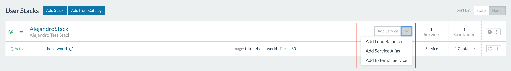
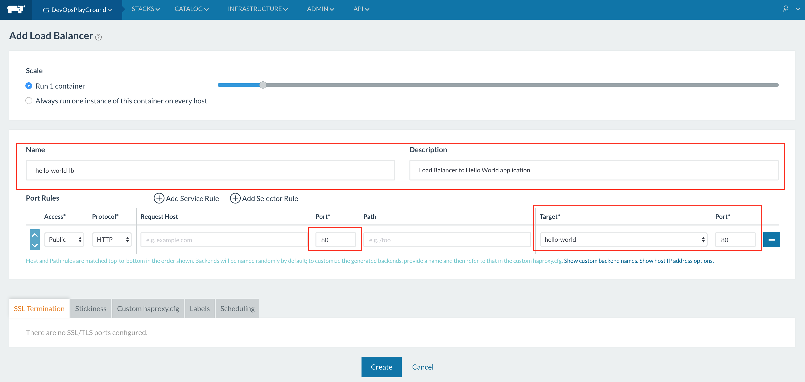

# Hands-on with Rancher

## Overview

"Rancher is an open source project that provides a complete platform for
operating Docker in production" (github official page). It allow us:

- Infrastructure orchestration
- Container level orchestration and scheduling.
- Multi-host networking (IPSEC network overlay)

We will explore some of Rancher's feature in the DevOps Playground

## Requirements

- A linux machine  -> you'll be provided with an AWS instance to ssh in.

- [Docker version supported by rancher ](http://docs.rancher.com/rancher/v1.3/en/hosts/#supported-docker-versions): ```curl https://releases.rancher.com/install-docker/1.12.sh | sh```

- +1GB of RAM -> not a problem here, since we are using AWS

## The Plan

The plan for this usecase is for all the machines to work together as descibed below : 


The Rancher server setup will be performed by the Presenter (Alejandro)
All the attendees will register their own Rancher host against the Rancher Server, create their stack and setup a load balancer.

## Step 0: Deploying the Rancher server [Presenter only]

Because To deploy the rancher server we only need to run:

```sudo docker run -d --restart=unless-stopped -p 8080:8080 rancher/server```

Spend at least 5 minutes playing with the rancher server interface, it will be
running under:

```http://<wait for URL/IP>:8080```

## Step 1: Deploying rancher agent

Deploying an agent is super easy in rancher, it is done through the web
interface, the steps are the following:

1. Check the VM is be able to reach the rancher server (you can use ```ping```)
   and also has internet connectivity (because it needs to pull containers)
1. Select the environment where you want to deploy the agent.
2. Go to "Infrastructure -> Hosts" and click "Add Host"
3. Copy and paste the docker output (command) in the virtual machine you want to
run the agent. 
4. Wait for the agent to appear in the host (it takes around one or two minutes). 

## Step 3: Creating our first stack

In rancher, a stack is a group of services (containers) which are grouped (usually
  deployed together)

We are going to create our first stack:

1. We need to click in "Stacks" -> "All" -> "Add Stack"
2. Fill the Stack name and description (optional)
3. Click "Create". 
4. Now we need to create a Service (container), for that we click in "Add Service": 
5. Specify Name & Description and write the image name, if you need some port mapping. 
6. Now you should see the container running: 


## Step 4: See container's logs and execute a shell within the container.

1. Go to Infrastructure -> Hosts and look for your container in the environment hosts.
2. Click in Options (three dots) and see the logs: 
3. Now select "Execute a Shell" to login inside your container

## Step 5: Create a Load Balancer on the top of your stack

Once you have your stack up and running we are going to put a LB on the top of it, so you can scale
the application container and it is transparent for the LB. In order to achieve that we need to:

1. Go to our stack and "Add Load Balancer" 
2. Write a name and description for LB and select the port and target: 
**NOTE**: The target port should be the same the one is exposing the application

## To Go Further - Step 5: Assign labels to your agent and define constraints
to your stack

To assign labels to the agent we need to:

1. Select the environment where the agent is running and go to Infrastructure -> hosts
2. Click in the agent you want to assign a label and go

## Further Reading

- [Rancher documentation](http://docs.rancher.com/)
